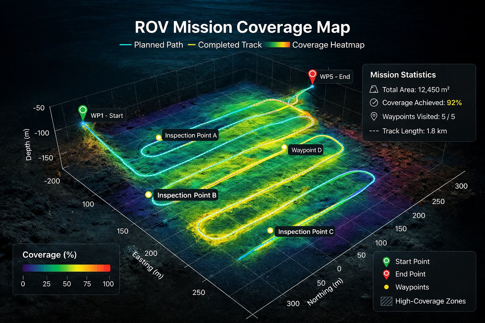
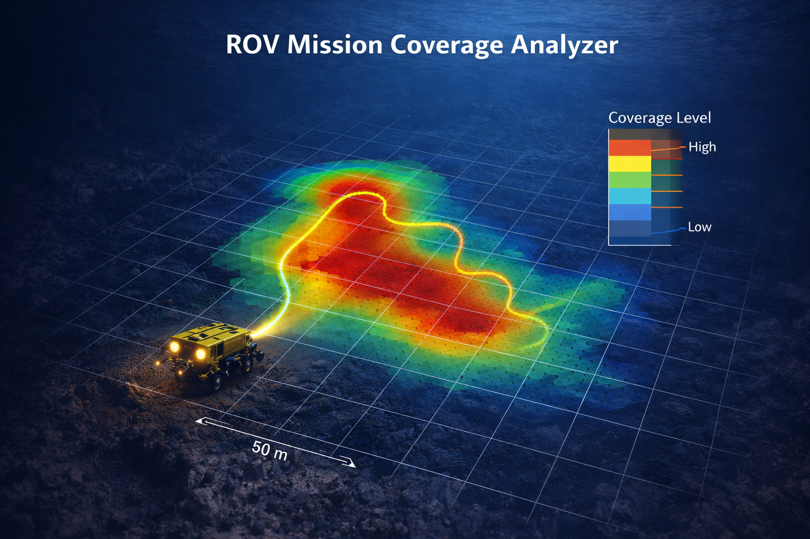

# ROV Inspection Coverage Analyzer

Python tool for analyzing ROV inspection coverage and mission metrics from subsea mission logs.

## Features

- Calculate total ROV mission distance
- Analyze inspection coverage
- Compute mission depth statistics
- Visualize inspection trajectory

## Technologies

- Python
- Pandas
- Plotly

## Example Output

Mission statistics including:

- Total mission distance
- Maximum depth
- Average depth
- Inspection trajectory visualization.

 
